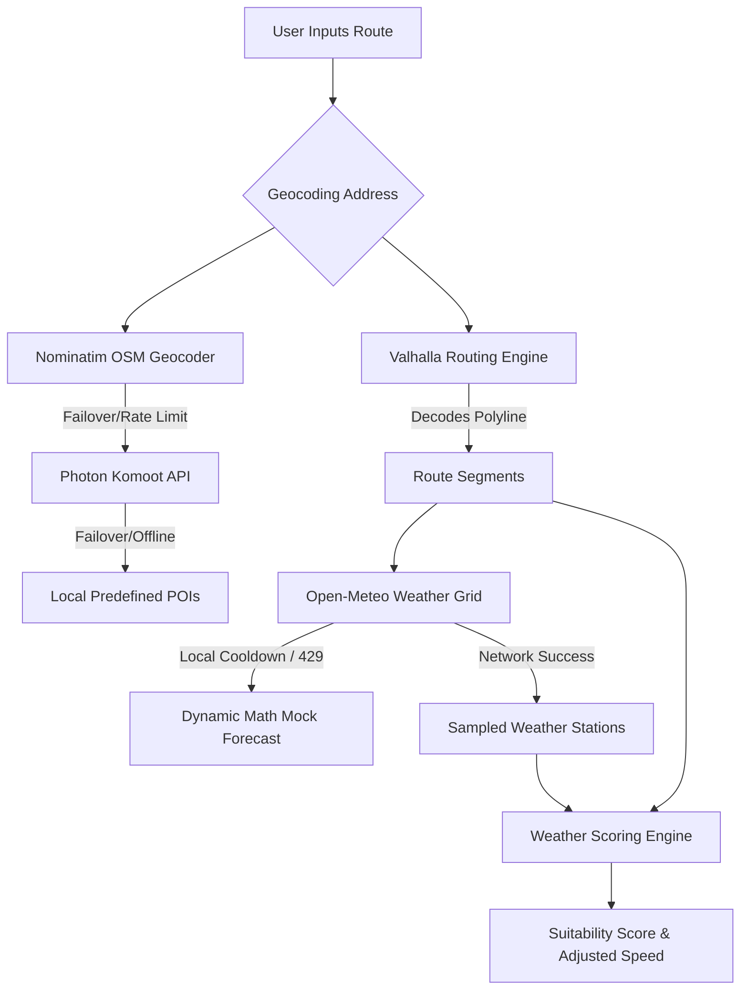

# 🚴 Biking Commute Forecast Web App

A weather-aware, real-time cycling commute planner built with **Next.js** (v16), **Leaflet**, and **React** (v19). This application calculates route-specific travel times, speeds, and suitability scores by dynamically evaluating meteorological conditions (wind vectors, precipitation, temperature, WMO weather codes) along your exact path.

---

## 🗺️ System Architecture Overview

The application utilizes public, free API resources to compute routing and forecast predictions. It is designed to be rate-limit resilient, utilizing sophisticated caching and fallback pipelines:



---

## ✨ Key Features

1. **Weather-Aware Commute Scoring**
   - Calculates a suitability score from `0` (dangerous) to `100` (perfect).
   - Aerodynamically processes headwinds (drag), tailwinds (speed gains), crosswinds (stability impact), and gusts to adjust segment-level speeds.
   - Subtracts comfort penalties for sub-optimal temperatures, rain probability, heavy precipitation, and WMO weather codes.
   - Instantly triggers safety warnings and reduces suitability to `0` if thunderstorms are detected.

2. **Smart Departure Convergence Loop**
   - When planning by **Desired Arrival Time**, the engine runs a feedback loop to calculate your exact departure time.
   - If the route suffers from a strong headwind, the app automatically increases estimated duration and recommends leaving earlier.

3. **Dynamic Route Weather Interpolation**
   - Samples between 2 and 5 coordinate points along your path depending on total distance (rather than querying a single location).
   - Computes weather metrics for each segment at your *estimated arrival time* at that segment, accounting for weather progression as you ride.

4. **Commute Profiles & Tagged Locations**
   - Save frequently used routes and name them (e.g., *Daily Commute to Work*).
   - Tag locations (e.g., `🏠 Home`, `💼 Work`) to quickly select origins and destinations.
   - Set up a **Weekly Planner** with outbound/return commutes, allowing you to view a 7-day outlook of suitability scores at a glance.

5. **Trip Packing Checklist (Gear Check)**
   - Displays a dynamic, weather-dependent packing list (e.g., recommending rain gear, sunscreen, high-visibility clothing, or extra hydration).

6. **Rate-Limit Resilience**
   - Throttles API network requests to respect fair-use policies.
   - Caches responses in local storage (`localStorage`) for geocoding, reverse geocoding, routing, and weather.
   - Under HTTP 429 (Too Many Requests), activates a cooldown state and falls back to a mathematical mock forecast to keep the UI fully functional.

---

## ⚙️ Environment Configuration (`.env.local`)

Create a `.env.local` file in the root directory to configure the application's runtime variables. 

```env
# Set to 'true' to format the Node terminal console logs in imperial units (Fahrenheit, miles, mph)
# If false/unset, logs will display in metric units.
IMPERIAL_LOGS=false

# Set to 'true' to run the application in offline simulated mode (no live network API calls)
# This will serve simulated weather/routing data and display warning indicators in the UI.
MOCK=false

# Set to 'true' to print verbose logs (detailed deductions and wind vectors) in the terminal logs
VERBOSE=false
```

---

## 🚀 Getting Started

### Prerequisites

Ensure you have [Node.js](https://nodejs.org/) installed (v18.x or later recommended).

### Installation

1. Clone or navigate into the repository.
2. Install dependencies:
   ```bash
   npm install
   ```

### Running the App

Start the development server:

```bash
npm run dev
```

Open [http://localhost:3000](http://localhost:3000) in your browser to view the application.

### Building for Production

To build the static application bundle:

```bash
npm run build
npm run start
```

---

## 🧪 CLI Testing & Verification Scripts

The codebase includes two command-line utility scripts located in the root directory to test and debug the scoring and routing engine directly from your terminal.

### 1. Simple Scoring Test (`test-scoring.js`)
Runs the weather scoring logic against static, simulated weather data to ensure math formulas and unit conversions calculate correctly.

```bash
# Run basic metric report
node test-scoring.js

# Run imperial report with verbose penalty logs
node test-scoring.js --imperial --verbose
```

### 2. Live/Mock Route Debugger (`debug-route.js`)
Tests geocoding, Valhalla routing, and Open-Meteo API requests. Can run against live API endpoints or in mocked offline mode.

```bash
# Run live geocoding/routing check (tests live network APIs)
node debug-route.js

# Run in mock mode (simulates network payloads offline)
node debug-route.js --mock

# Combine CLI flags
node debug-route.js --mock --verbose --imperial
```

**Supported Flags:**
- `-v`, `--verbose` : Prints detailed wind vectors, bearings, and penalty deductions.
- `-i`, `--imperial`: Formats output variables in Fahrenheit, mph, and miles.
- `-m`, `--mock`    : Forces offline mock data instead of calling live services (only available in `debug-route.js`).

---

## 📁 Key File Structure

- [src/app/page.js](file:///c:/Users/emb16/Documents/biking-forecast/src/app/page.js): The main application view containing HUD states, Leaflet Map wrapper, saved routes, and weekly planner layout.
- [src/utils/weatherScoring.js](file:///c:/Users/emb16/Documents/biking-forecast/src/utils/weatherScoring.js): The core mathematical engine containing WMO maps, headwind/crosswind calculation, penalty deductions, and the departure time feedback convergence loop.
- [src/utils/api.js](file:///c:/Users/emb16/Documents/biking-forecast/src/utils/api.js): Geocoding, reverse geocoding, Open-Meteo, and Valhalla OSM integrations with local storage caching and error handling.
- [src/components/ScoreMetric.js](file:///c:/Users/emb16/Documents/biking-forecast/src/components/ScoreMetric.js): Displays the suitability score gauge, travel duration/distance, wind impact, and penalty deductions.
- [src/components/WeatherDetails.js](file:///c:/Users/emb16/Documents/biking-forecast/src/components/WeatherDetails.js): Renders station-by-station conditions (Start, Mid, End) with custom compass arrow wind indicators.
- [src/components/TripPlanner.js](file:///c:/Users/emb16/Documents/biking-forecast/src/components/TripPlanner.js): Custom route configuration input, destination autocomplete list, profile managers, and arrival mode toggle.
- [test-scoring.js](file:///c:/Users/emb16/Documents/biking-forecast/test-scoring.js): CLI execution script to test formula rules.
- [debug-route.js](file:///c:/Users/emb16/Documents/biking-forecast/debug-route.js): CLI debugger to run end-to-end routing/weather verification.
